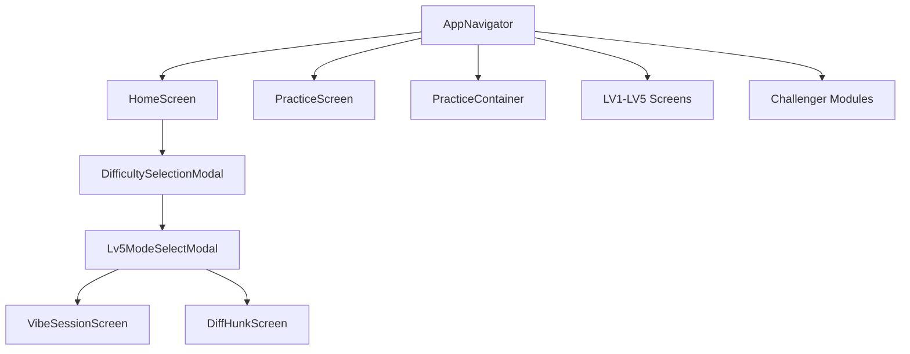
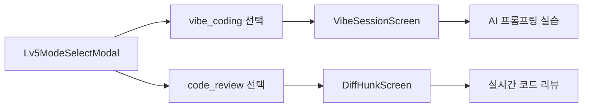

# DayScript 프로젝트 최종 아키텍처 분석 보고서

## 📊 프로젝트 개요

**DayScript**는 React Native 기반의 프로그래밍 학습 모바일 애플리케이션으로, LV1부터 LV5까지의 체계적인 단계별 학습 시스템을 제공합니다. 특히 LV5 단계에서는 AI 기반 Vibe Coding과 실시간 코드 리뷰 기능을 통해 전문가 수준의 실무 능력을 평가하는 혁신적인 학습 플랫폼입니다.

---

## 🌳 완전한 파일 구조 트리

```
src/
├── components/                           # 재사용 가능한 UI 컴포넌트
│   ├── BottomNavigation/                # 하단 네비게이션 시스템
│   │   ├── BottomNavigationBar.tsx      # 메인 네비게이션 바 컴포넌트
│   │   ├── BottomNavigationBar.styles.ts # 네비게이션 바 스타일
│   │   └── index.ts                     # 내보내기 파일
│   ├── Effects/                         # 시각 효과 컴포넌트
│   │   ├── CanvasConfetti.tsx           # 축하 애니메이션 효과
│   │   ├── CanvasConfetti.styles.ts     # 애니메이션 스타일
│   │   └── CanvasConfetti.types.ts      # 애니메이션 타입 정의
│   ├── Home/                            # 홈 화면 전용 컴포넌트
│   │   ├── LearningStatus.tsx           # 학습 진행 상태 표시
│   │   ├── QuickActions.tsx             # 빠른 실행 버튼들
│   │   ├── Ranking.tsx                  # 사용자 랭킹 표시
│   │   ├── TerminalHeader.tsx           # 터미널 스타일 헤더
│   │   ├── TodayQuests.tsx              # 일일 퀘스트 표시
│   │   └── index.ts                     # 홈 컴포넌트 내보내기
│   ├── Modals/                          # 모달 컴포넌트 시스템
│   │   ├── DifficultySelectionModal.tsx # 난이도 선택 모달 (핵심 라우팅)
│   │   ├── DifficultySelectionModal.styles.ts # 난이도 선택 스타일
│   │   ├── DifficultySelectionModal.test.tsx # 난이도 선택 테스트
│   │   ├── GoalCompletionModal.tsx      # 목표 완료 축하 모달
│   │   ├── GoalCompletionModal.styles.ts # 완료 모달 스타일
│   │   ├── GoalCompletionModal.types.ts # 완료 모달 타입
│   │   ├── Lv5ModeSelectModal.tsx       # LV5 모듈 선택 모달
│   │   ├── Lv5ModeSelectModal.styles.ts # LV5 모달 스타일
│   │   ├── ProblemReviewModal.tsx       # 문제 리뷰 모달
│   │   ├── ProblemReviewModal.styles.ts # 리뷰 모달 스타일
│   │   ├── ProblemReviewModal.types.ts  # 리뷰 모달 타입
│   │   ├── RandomNavigationIntegration.test.tsx # 네비게이션 테스트
│   │   └── index.ts                     # 모달 내보내기
│   ├── Practice/                        # 연습 화면 공용 컴포넌트
│   │   ├── DifficultySelect.tsx         # 난이도 선택 컴포넌트
│   │   ├── FilterSection.tsx            # 필터링 섹션
│   │   ├── LanguageToggle.tsx           # 언어 토글 버튼
│   │   ├── ProblemCard.tsx              # 문제 카드 컴포넌트
│   │   ├── SortSelect.tsx               # 정렬 선택 컴포넌트
│   │   └── index.ts                     # 연습 컴포넌트 내보내기
│   └── Progress/                        # 진행률 표시 컴포넌트
│       ├── CircularProgress.tsx         # 원형 진행률 표시
│       ├── CircularProgress.styles.ts   # 진행률 스타일
│       └── CircularProgress.types.ts    # 진행률 타입
├── constants/                           # 전역 상수 정의
│   ├── colors.ts                        # 컬러 팔레트 시스템
│   ├── fonts.ts                         # 폰트 및 타이포그래피
│   ├── sizes.ts                         # 크기 및 간격 시스템
│   └── index.ts                         # 상수 통합 내보내기
├── data/                                # 데이터 관리
│   ├── problems/                        # 문제 데이터셋
│   │   ├── multipleChoiceProblemsData.ts # LV2 객관식 문제 데이터
│   │   └── oxProblemsData.ts            # LV1 O/X 문제 데이터
│   └── sessionManager.ts                # 세션 상태 관리
├── hooks/                               # 커스텀 훅
│   └── useHint.ts                       # 힌트 시스템 훅
├── navigation/                          # 내비게이션 시스템
│   ├── AppNavigator.tsx                 # 메인 네비게이션 라우터
│   └── index.ts                         # 네비게이션 내보내기
├── screens/                             # 화면 컴포넌트들
│   ├── Home/                            # 홈 화면
│   │   ├── HomeScreen.tsx               # 메인 홈 화면
│   │   ├── Home.styles.ts               # 홈 화면 스타일
│   │   └── Home.types.ts                # 홈 화면 타입
│   └── Practice/                        # 연습 화면들
│       ├── Advanced/                    # LV4 고급 디버깅 모드
│       │   ├── components/              # LV4 전용 컴포넌트
│       │   │   ├── CodeEditor.tsx       # 코드 에디터
│       │   │   ├── CodeEditor.styles.ts # 에디터 스타일
│       │   │   ├── DebuggingHintCard.tsx # 디버깅 힌트 카드
│       │   │   ├── DebuggingHintCard.styles.ts # 힌트 카드 스타일
│       │   │   ├── DebugSimulationModal.tsx # 디버깅 시뮬레이션
│       │   │   ├── DebugSimulationModal.styles.ts # 시뮬레이션 스타일
│       │   │   ├── ProgressBar.tsx      # 진행률 바
│       │   │   └── ShakeAnimation.tsx   # 오답 시 흔들림 애니메이션
│       │   ├── Lv4DebuggingScreen.tsx   # LV4 메인 화면
│       │   ├── Lv4DebuggingScreen.styles.ts # LV4 스타일
│       │   ├── Lv4DebuggingScreen.types.ts # LV4 타입
│       │   ├── Lv4DebuggingScreen.test.tsx # LV4 테스트
│       │   └── index.ts                 # LV4 내보내기
│       ├── Challenger/                  # LV5 챌린저 모드 (신규 독립 구조)
│       │   ├── components/              # 챌린저 전용 컴포넌트
│       │   │   ├── CodeEditor.tsx       # 고급 코드 에디터
│       │   │   ├── CommitCard.tsx       # 커밋 정보 카드
│       │   │   ├── ConversationPanel.tsx # AI 대화 패널
│       │   │   ├── ResultPreviewPanel.tsx # 결과 미리보기
│       │   │   ├── ScenarioSection.tsx  # 시나리오 섹션
│       │   │   └── TokenMonitor.tsx     # 토큰 사용량 모니터
│       │   ├── DiffHunkScreen.tsx       # 📍 코드 리뷰 Diff 화면 (신규)
│       │   ├── DiffHunkScreen.styles.ts # Diff 화면 스타일
│       │   ├── DiffHunkScreen.types.ts  # Diff 화면 타입
│       │   ├── PRInboxScreen.tsx        # PR 인박스 화면
│       │   ├── PRInboxScreen.styles.ts  # PR 인박스 스타일
│       │   ├── PRInboxScreen.types.ts   # PR 인박스 타입
│       │   ├── VibeSessionScreen.tsx    # Vibe Coding 세션 화면
│       │   ├── VibeSessionScreen.styles.ts # Vibe 세션 스타일
│       │   └── VibeSessionScreen.types.ts # Vibe 세션 타입
│       ├── Expert/                      # LV5 전문가 모드 (기존 모듈 구조)
│       │   ├── components/              # 전문가 모드 컴포넌트
│       │   │   ├── CodeReview/          # 코드 리뷰 모듈
│       │   │   │   ├── CodeReviewModule.tsx # 코드 리뷰 모듈
│       │   │   │   ├── HunkDiffView.tsx # Hunk Diff 뷰
│       │   │   │   ├── HunkDiffView.styles.ts # Diff 뷰 스타일
│       │   │   │   ├── ProgressIndicator.tsx # 진행률 표시
│       │   │   │   └── ProgressIndicator.styles.ts # 진행률 스타일
│       │   │   ├── Shared/              # 공유 컴포넌트
│       │   │   │   ├── ExpertModeErrorBoundary.tsx # 에러 경계
│       │   │   │   ├── ExpertModeTabNavigation.tsx # 탭 네비게이션
│       │   │   │   └── TimerComponent.tsx # 타이머 컴포넌트
│       │   │   └── VibeCoding/          # Vibe Coding 모듈
│       │   │       └── VibeCodingModule.tsx # Vibe Coding 모듈
│       │   ├── Lv5ExpertModeScreen.tsx  # LV5 전문가 메인 화면
│       │   ├── Lv5ExpertModeScreen.styles.ts # 전문가 모드 스타일
│       │   └── Lv5ExpertModeScreen.types.ts # 전문가 모드 타입
│       ├── Lv1OXProblemScreen.tsx       # LV1 O/X 문제 화면
│       ├── Lv1OXProblemScreen.styles.ts # LV1 스타일
│       ├── Lv1OXProblemScreen.types.ts  # LV1 타입
│       ├── Lv1OXProblemScreen.test.tsx  # LV1 테스트
│       ├── Lv2MultipleChoiceProblemScreen.tsx # LV2 객관식 화면
│       ├── Lv2MultipleChoiceProblemScreen.styles.ts # LV2 스타일
│       ├── Lv2MultipleChoiceProblemScreen.types.ts # LV2 타입
│       ├── Lv2MultipleChoiceProblemScreen.test.tsx # LV2 테스트
│       ├── Lv3FillInTheBlankProblemScreen.tsx # LV3 빈칸 채우기 화면
│       ├── Lv3FillInTheBlankProblemScreen.styles.ts # LV3 스타일
│       ├── Lv3FillInTheBlankProblemScreen.types.ts # LV3 타입
│       ├── Lv3FillInTheBlankProblemScreen.test.tsx # LV3 테스트
│       ├── PracticeContainer.tsx        # 문제 유형별 컨테이너
│       ├── PracticeContainer.types.ts   # 컨테이너 타입
│       ├── PracticeScreen.tsx           # 연습 메인 화면
│       ├── PracticeScreen.test.tsx      # 연습 화면 테스트
│       ├── Practice.styles.ts           # 연습 화면 스타일
│       └── index.ts                     # 연습 화면 내보내기
└── types/                               # TypeScript 타입 정의
    ├── common.ts                        # 공통 타입 정의
    └── practice.ts                      # 연습 관련 타입
```

---

## 🏗️ 핵심 컴포넌트 관계 매핑

### 1. **중앙 내비게이션 시스템**



**AppNavigator**는 전체 애플리케이션의 라우팅 중심점으로 작동하며, Mock Navigation 객체를 통해 모든 화면 전환을 관리합니다.

### 2. **모달 시스템 아키텍처**

#### **DifficultySelectionModal ↔ HomeScreen**
- **역할**: 학습 레벨 선택의 핵심 게이트웨이
- **관계**: HomeScreen의 QuickActions에서 호출
- **기능**:
  - 순차적 잠금 해제 시스템 (현재 테스트용으로 전체 해제)
  - 각 난이도별 문제 유형 매핑 및 라우팅
  - 사용자 진행 상태 추적 및 검증

#### **Lv5ModeSelectModal ↔ DifficultySelectionModal**
- **역할**: LV5 전문가 모드 분기점
- **관계**: DifficultySelectionModal에서 'Challenge' 선택 시 호출
- **기능**:
  - Vibe Coding과 Code Review 모듈 선택
  - 각 모듈별 독립적인 화면으로 네비게이션
  - 즉시 모달 닫기 및 화면 전환 처리

### 3. **PracticeContainer ↔ 각 레벨 스크린**

```typescript
// 문제 유형별 매핑 관계
PracticeContainer → {
  problemType: 'OX' → Lv1OXProblemScreen,
  problemType: 'MULTIPLE_CHOICE' → Lv2MultipleChoiceProblemScreen,
  problemType: 'FILL_IN_BLANK' → Lv3FillInTheBlankProblemScreen,
  problemType: 'DEBUGGING' → Lv4DebuggingScreen,
}
```

**PracticeContainer**는 문제 유형에 따른 중간 라우터 역할을 수행하며, 각 레벨별 화면의 공통 로직을 처리합니다.

### 4. **GoalCompletionModal ↔ Problem Screens**

#### **연결 관계**
- **LV1, LV2**: 직접 연결 (완료 시 자동 호출)
- **LV3, LV4**: 독립적인 완료 처리 (각자의 완료 로직)
- **LV5**: 모듈별 독립적인 완료 시스템

#### **데이터 흐름**
```
Problem Screen → 문제 완료 → GoalCompletionModal →
축하 애니메이션 → 점수 기록 → 다음 단계 안내
```

### 5. **LV5 모듈 분기 시스템**

#### **DiffHunkScreen ↔ VibeSessionScreen**


**분기점 특징:**
- **독립적 실행**: 각 모듈은 완전히 독립적으로 실행
- **복귀 경로**: 모든 모듈은 'Practice' 화면으로 복귀
- **상태 관리**: 각 모듈별 독립적인 useReducer 패턴 적용

---

## 🔄 데이터 흐름 및 상태 관리

### 1. **전체 데이터 흐름**

```
AppNavigator (중앙 상태)
    ↓
HomeScreen (로컬 상태: 퀘스트, 언어 선택)
    ↓
DifficultySelectionModal (진행 상태 관리)
    ↓
PracticeContainer (문제 세션 관리)
    ↓
각 레벨 화면 (문제별 상태)
    ↓
GoalCompletionModal (완료 결과)
```

### 2. **상태 관리 패턴 분석**

#### **Reducer 패턴 적용 화면**
- **VibeSessionScreen**: `vibeSessionReducer`
  - 세션 상태, 대화 내역, 토큰 사용량 관리
- **DiffHunkScreen**: `diffHunkReducer`
  - Hunk 검토 상태, 진행률, 편집 모드 관리
- **Lv5ExpertModeScreen**: `expertModeReducer`
  - 전문가 모드 통합 상태 관리

#### **Local State 관리**
- **기본 문제 화면들**: useState 기반 단순 상태
- **HomeScreen**: 퀘스트 및 언어 선택 상태
- **모달 컴포넌트들**: 가시성 및 선택 상태

### 3. **Props Drilling 최소화 전략**

- **Mock Navigation**: 화면 간 파라미터 전달 표준화
- **컴포넌트 독립성**: 각 화면별 자체 상태 관리
- **타입 안전성**: TypeScript 인터페이스로 props 검증

---

## 🏛️ 아키텍처 설계 원칙

### 1. **SOLID 원칙 적용**

#### **단일 책임 원칙 (SRP)**
- ✅ 각 화면은 하나의 학습 단계만 담당
- ✅ 모달은 특정 선택 기능만 수행
- ✅ 스타일, 타입, 로직의 명확한 파일 분리

#### **개방-폐쇄 원칙 (OCP)**
- ✅ PracticeContainer를 통한 새로운 문제 유형 확장 가능
- ✅ LV5 모듈 시스템으로 새로운 전문가 모듈 추가 용이
- ✅ 컴포넌트 인터페이스 변경 없이 기능 확장

#### **인터페이스 분리 원칙 (ISP)**
- ✅ 화면별 독립적인 Props 인터페이스
- ✅ 공통 타입과 화면별 타입의 명확한 분리
- ✅ 필요한 의존성만 주입받는 구조

### 2. **모듈화 및 재사용성**

#### **컴포넌트 계층 구조**
```
전역 컴포넌트 (components/)
    ↓
화면별 컴포넌트 (screens/.../components/)
    ↓
특수 목적 컴포넌트 (Challenger/Expert 전용)
```

#### **스타일 시스템**
- **중앙화된 디자인 토큰**: `constants/` 폴더의 색상, 폰트, 크기
- **컴포넌트별 스타일 분리**: `.styles.ts` 파일로 관리
- **일관된 UI/UX**: 전체 앱에서 통일된 디자인 언어

### 3. **성능 최적화 전략**

#### **Lazy Loading**
- **LV5 Expert 모드**: React.lazy()를 사용한 동적 로딩
- **대용량 모듈**: 필요시점에만 로드

#### **상태 최적화**
- **useCallback/useMemo**: 불필요한 렌더링 방지
- **Reducer 패턴**: 복잡한 상태 변경 최적화
- **컴포넌트 메모이제이션**: 성능 크리티컬 컴포넌트 최적화

---

## 🎯 핵심 혁신 기능

### 1. **LV5 이중 아키텍처**

#### **Challenger 모드 (신규 독립 구조)**
```
- VibeSessionScreen: AI 프롬프팅 실전 훈련
- DiffHunkScreen: 실시간 코드 리뷰 시뮬레이션
- PRInboxScreen: PR 관리 워크플로우
```

#### **Expert 모드 (기존 모듈 구조)**
```
- Lv5ExpertModeScreen: 통합 관리 화면
- VibeCodingModule: 모듈형 AI 코딩
- CodeReviewModule: 모듈형 코드 리뷰
```

### 2. **실시간 코드 리뷰 시스템 (DiffHunkScreen)**

#### **핵심 기능**
- **통합 Diff View**: Git diff 시각화와 동일한 UX
- **Hunk 단위 인터랙션**: Accept/Reject/Edit/Comment 액션
- **실시간 편집**: 코드 직접 수정 및 개선 제안
- **세션 추적**: 검토 진행률 및 완료 상태 실시간 모니터링

#### **기술적 특징**
- **TypeScript 강타입**: 완전한 타입 안전성 보장
- **복잡한 상태 관리**: diffHunkReducer로 체계적 관리
- **접근성 고려**: 스크린 리더 및 고대비 지원

### 3. **AI 기반 Vibe Coding (VibeSessionScreen)**

#### **혁신적 학습 방식**
- **실시간 AI 대화**: 자연어 프롬프팅 훈련
- **토큰 사용량 모니터링**: 효율적인 프롬프트 작성 훈련
- **결과 미리보기**: 즉시 피드백 시스템

---

## 📊 확장성 및 유지보수성 평가

### ✅ **주요 강점**

1. **모듈형 아키텍처**
   - 각 레벨별 완전히 독립적인 구조
   - 새로운 문제 유형 추가 용이성
   - LV5 이중 구조로 다양한 학습 방식 지원

2. **강력한 타입 시스템**
   - TypeScript 100% 적용
   - 인터페이스 기반 컴포넌트 설계
   - 컴파일 타임 오류 방지

3. **체계적인 파일 구조**
   - 기능별/레벨별 명확한 폴더 분리
   - 스타일/타입/로직의 일관된 분리
   - 직관적인 네이밍 컨벤션

4. **확장 가능한 설계**
   - 새로운 난이도 레벨 추가 가능
   - 모달 시스템 확장 용이
   - 컴포넌트 재사용성 극대화

### 🔄 **개선 가능 영역**

1. **전역 상태 관리**
   - Redux 또는 Zustand 도입 검토
   - 사용자 진행 상태 중앙 관리
   - 성능 최적화를 위한 상태 정규화

2. **테스트 커버리지**
   - 현재 일부 컴포넌트만 테스트 존재
   - E2E 테스트 프레임워크 도입
   - Mock 데이터 시스템 강화

3. **에러 처리 시스템**
   - 중앙화된 에러 경계 구축
   - 사용자 친화적 에러 메시지
   - 오류 복구 메커니즘 강화

4. **성능 모니터링**
   - 렌더링 성능 측정 도구
   - 메모리 사용량 최적화
   - 번들 크기 최적화

---

## 🎯 향후 백엔드 개발 가이드

### 1. **API 엔드포인트 설계**

#### **사용자 진행 상태 API**
```typescript
// 진행 상태 조회
GET /api/user/{userId}/progress
// 진행 상태 업데이트
PUT /api/user/{userId}/progress
// 레벨 완료 처리
POST /api/user/{userId}/level/{levelId}/complete
```

#### **문제 데이터 API**
```typescript
// 레벨별 문제 조회
GET /api/problems/level/{levelId}
// 사용자 답안 제출
POST /api/problems/{problemId}/submit
// 힌트 요청
GET /api/problems/{problemId}/hints
```

#### **LV5 전문가 모드 API**
```typescript
// Vibe Session 관리
POST /api/vibe-session/start
PUT /api/vibe-session/{sessionId}/message
GET /api/vibe-session/{sessionId}/status

// Code Review 관리
POST /api/code-review/start
PUT /api/code-review/{sessionId}/hunk/{hunkId}/decision
GET /api/code-review/{sessionId}/progress
```

### 2. **데이터베이스 설계 가이드**

#### **핵심 엔티티**
```sql
-- 사용자 진행 상태
users_progress {
  user_id: UUID,
  current_level: VARCHAR,
  unlocked_levels: JSON,
  completed_levels: JSON,
  level_stats: JSON
}

-- 문제 데이터
problems {
  id: UUID,
  level: VARCHAR,
  type: VARCHAR,
  content: JSON,
  difficulty: VARCHAR
}

-- 세션 기록
learning_sessions {
  id: UUID,
  user_id: UUID,
  level: VARCHAR,
  start_time: TIMESTAMP,
  end_time: TIMESTAMP,
  score: INTEGER,
  session_data: JSON
}
```

### 3. **실시간 기능 구현 가이드**

#### **WebSocket 연결**
- **Vibe Session**: AI 대화 실시간 처리
- **Code Review**: 실시간 협업 기능
- **진행률 동기화**: 다중 디바이스 지원

#### **성능 최적화**
- **Redis 캐싱**: 문제 데이터 및 세션 상태
- **CDN 활용**: 정적 리소스 최적화
- **API 레이트 리미팅**: 남용 방지

---

## 📋 결론 및 권장사항

### 🏆 **종합 평가**

DayScript 프로젝트는 교육 앱으로서 매우 체계적이고 확장 가능한 아키텍처를 구현했습니다. 특히 LV5의 이중 구조(Challenger/Expert)와 실시간 코드 리뷰 기능은 혁신적인 학습 경험을 제공하며, SOLID 원칙에 기반한 설계로 장기적인 유지보수성을 확보했습니다.

### 🎯 **즉시 실행 권장사항**

1. **테스트 커버리지 확대** (우선순위: 높음)
   - 모든 핵심 컴포넌트에 대한 단위 테스트 작성
   - E2E 테스트로 사용자 플로우 검증

2. **에러 처리 시스템 구축** (우선순위: 중간)
   - 전역 에러 경계 구현
   - 사용자 친화적 에러 페이지

3. **성능 최적화** (우선순위: 중간)
   - 번들 분석 및 최적화
   - 이미지 및 리소스 최적화

### 🚀 **장기 발전 방향**

1. **백엔드 통합**: 실시간 데이터 동기화 및 사용자 진행 상태 관리
2. **AI 기능 강화**: 더욱 정교한 코드 리뷰 및 프롬프팅 시스템
3. **소셜 기능**: 사용자 간 경쟁 및 협업 기능
4. **다국어 지원**: 글로벌 확장을 위한 i18n 시스템

현재 구현된 아키텍처는 이러한 모든 확장 계획을 지원할 수 있는 견고한 기반을 제공하며, 지속적인 발전과 혁신이 가능한 구조로 평가됩니다.